# 安裝Redis-6.0.5_docker版-以Win 10為例
<p style="text-align:right;">2020.07.12 蔡元泰製</p> 

## 目錄  
- [前言](#前言)  
- [安裝 docker for windows 桌機板](#安裝-docker-for-windows-桌機板)  
- [修改映像檔存放位置](#修改映像檔存放位置)  
- [安裝 redis-6.0.5](#安裝-redis-605)  
- [測試](#測試)  
- [參考來源](#參考來源)

---

## 注意事項: 
### 若有使用VMware等虛擬機器軟體，本文不建議於Windows上安裝Docker，避免前述等軟體在使用上的麻煩.  

---

## 前言   
因Redis Windows版僅支援到Redis 3.2 版，所以採以doker安裝Redis-6.0.5版. [[1]](#[1])  
<https://github.com/MicrosoftArchive/redis>  
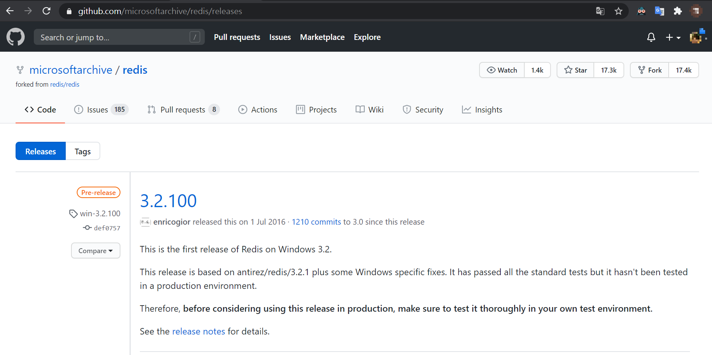  
---

## 安裝 docker for windows 桌機板 
1. 控制台 > > 程式和功能 > 開啟或關閉Windos功能 > 打勾Hyper-V功能
   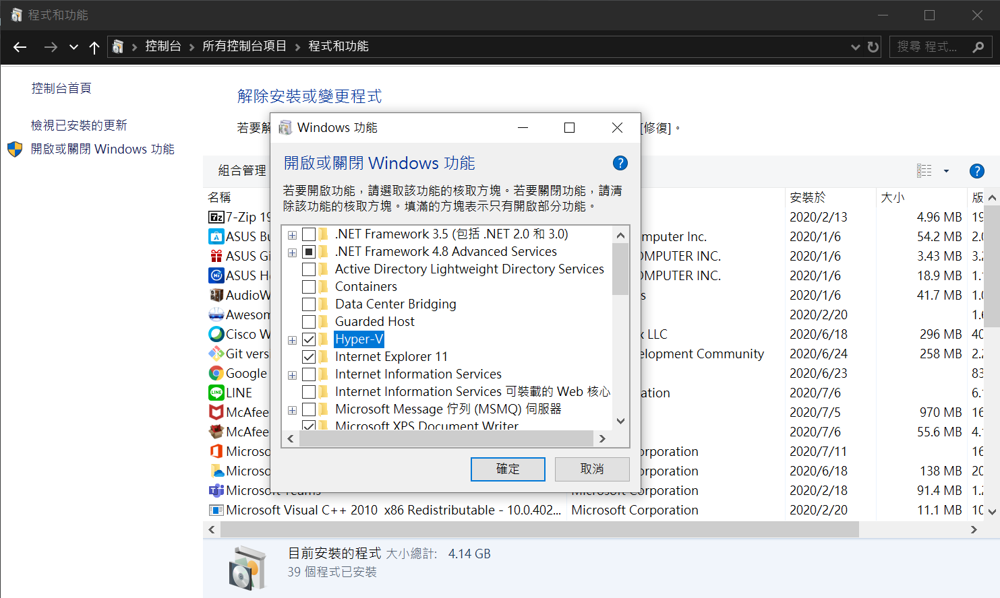 
2. 重開機 
3. 下載穩定版安裝檔  
https://hub.docker.com/editions/community/docker-ce-desktop-windows/  
   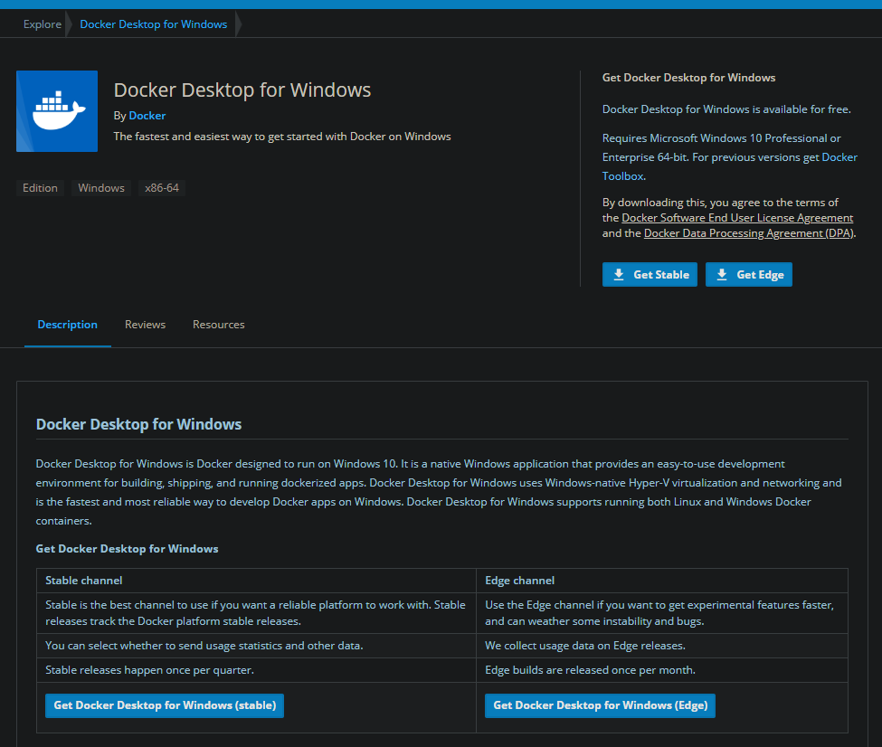  
4. 開始安裝
   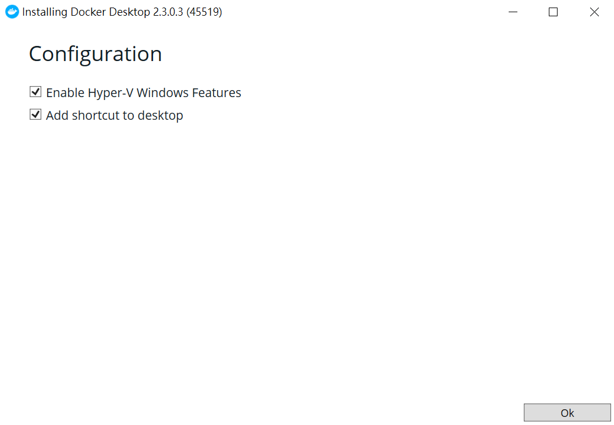  
   安裝成功
   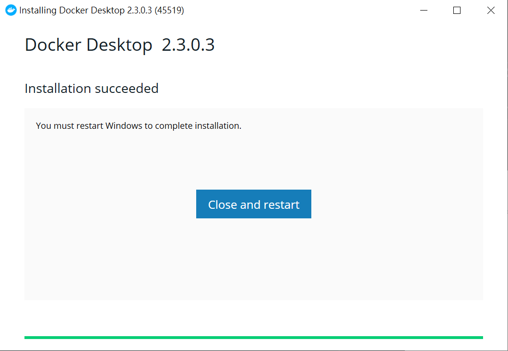 
5. 重開機
6. 測試是否有成功安裝  
   打開powershell，執行下列指令:
   ```powershell
   > docker --version Docker version 
   > docker-compose --version 
   ```  
   成功
   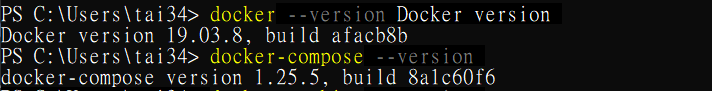 

[回到目錄](#目錄) 

---

## 修改映像檔存放位置
1. 打開docker  
   桌面左下角會出現docker圖示.
    
2.  點擊儀錶板(Dashboard)
   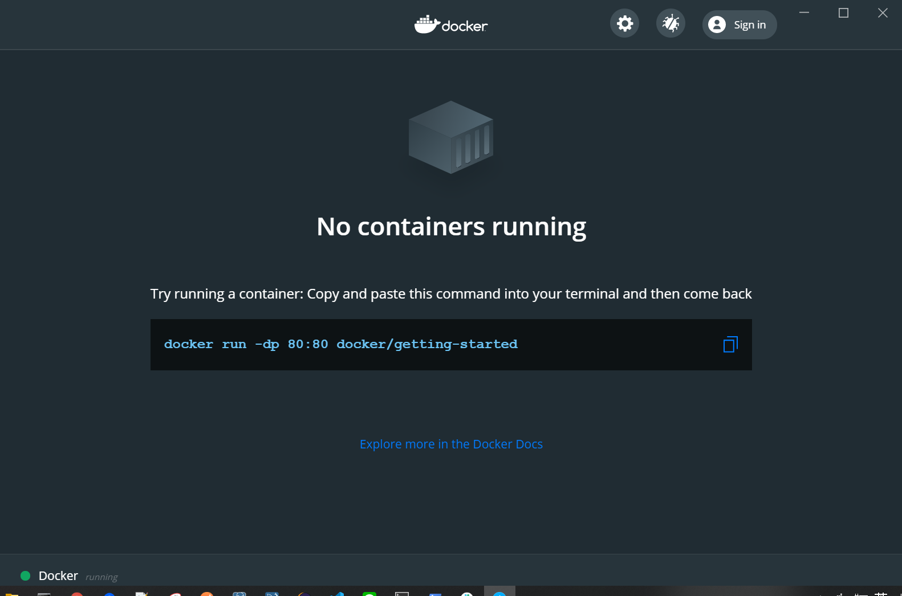  
3. 按右上角的齒輪(setting) > 左列Resource > ADVANCED > 輸入存放位置
   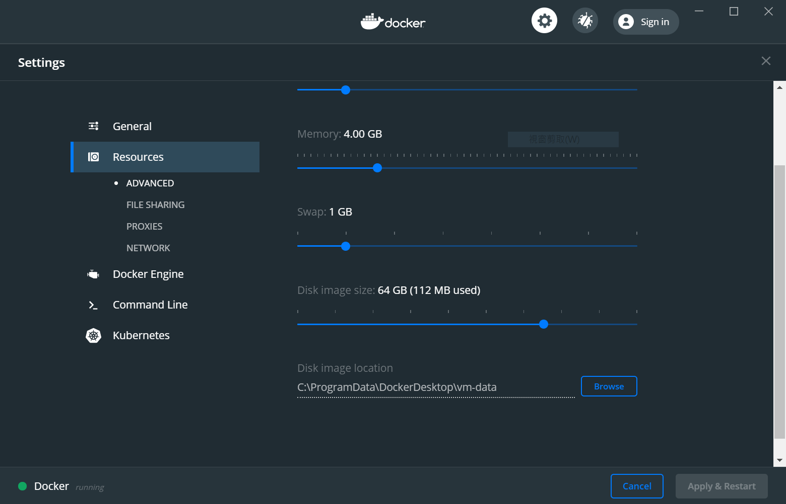  
4. 嘗試執行容器 (可略過)  
   1. 開啟powershell執行以下指令:
      ```powershell
      >docker run -dp 80:80 docker/getting-started
      ```
   2.  右鍵桌面左下角會出現docker圖示
      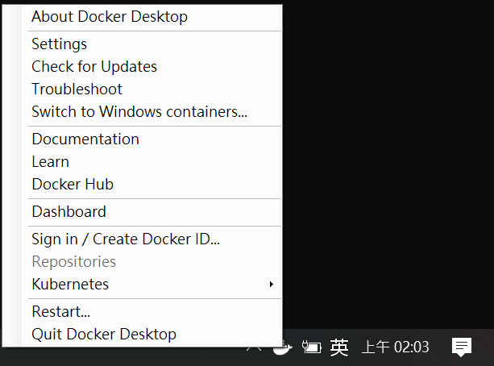 
   3. 點擊儀錶板(Dashboard)
      有容器在執行, 成功!
      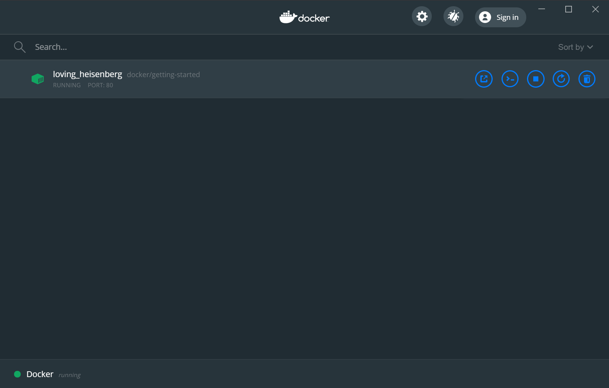 

[回到目錄](#目錄) 

---

## 安裝 redis-6.0.5 
於powershell執行下列指令: [[2]](#[2])  
1.下載redis-6.0.5
   ```powershell
   > docker pull redis:6.0.5
   ```
   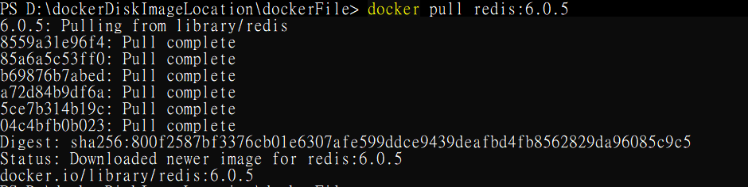 
2. 確認docker images
   ```powershell
   > docker images  
   ```
   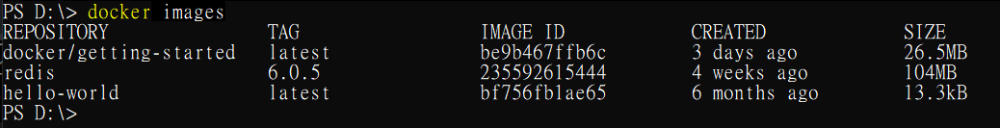 
3. 運行redis-6.0.5
   ```powershell
   > docker run -itd --name redis-6.0.5 -p 6379:6379 redis:6.0.5
   ```
   備註: -p 6379:6379：映射容器服務的 6379 端口到宿主機的 6379 端口。外部可以直接通過宿主機ip:6379 訪問到 Redis 的服務。
   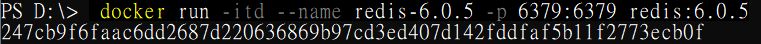  
4. 檢視docker擊儀錶板畫面
   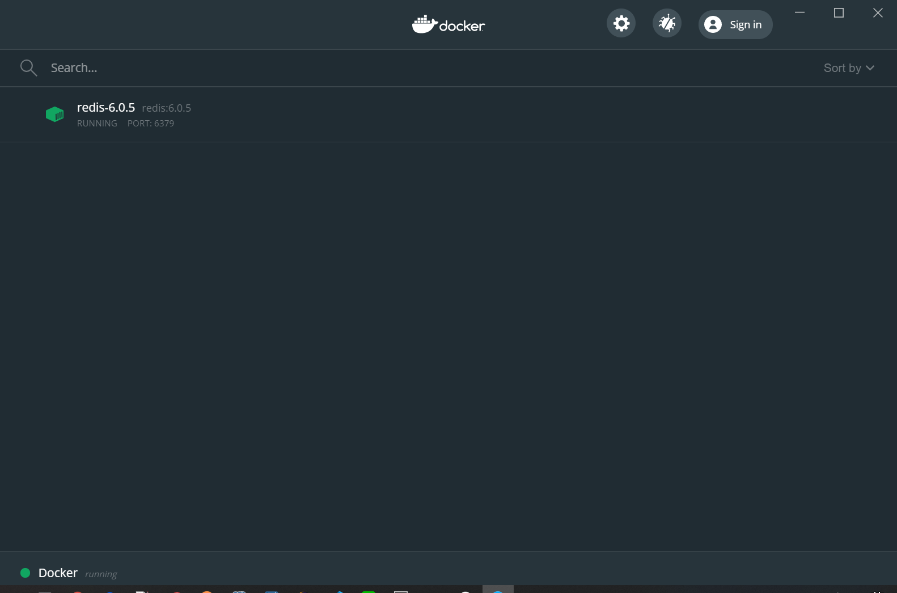
5. 成功!

[回到目錄](#目錄) 

---

## 測試
於powershell執行下列指令: [[2]](#[2]) 
1. 進入容器
   ```powershell
   > docker exec -it redis-6.0.5 /bin/bash
   ```
   
2. 執行Redis客戶端
   ```shell
   : docker exec -it redis-6.0.5 /bin/bash
   ```
   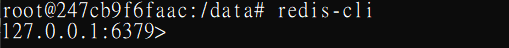
3. 新增資料
   ```shell
   > set foo bar
   ```  
   
4. 取資料
   ```shell
   > get bar
   ```
      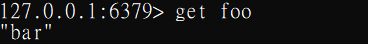

[回到目錄](#目錄) 

---

## 參考來源
1. https://marcus116.blogspot.com/2019/02/how-to-install-redis-in-windows-os.html <a name='[1]'></a>
2. https://www.runoob.com/docker/docker-install-redis.html <a name='[2]'></a>