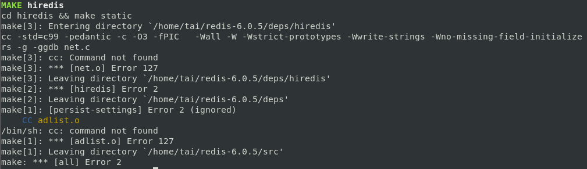
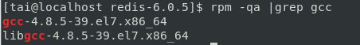
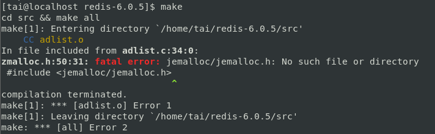
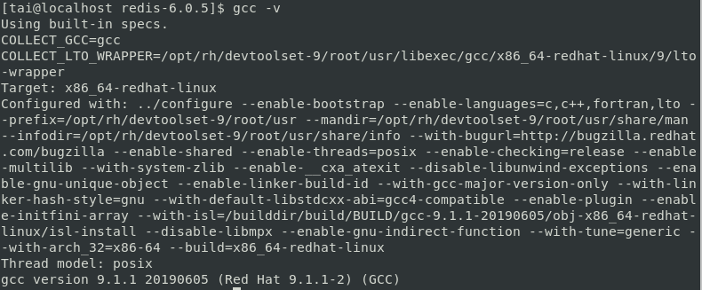
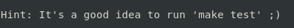
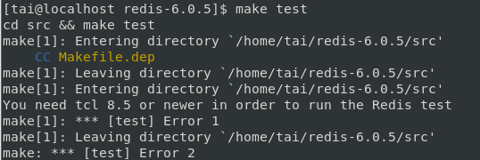
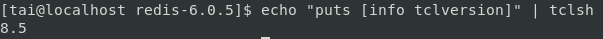
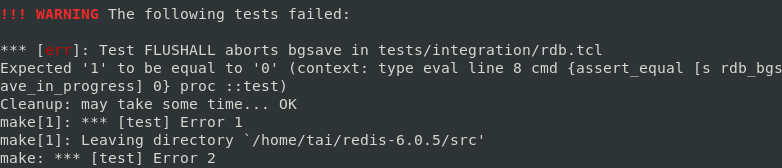
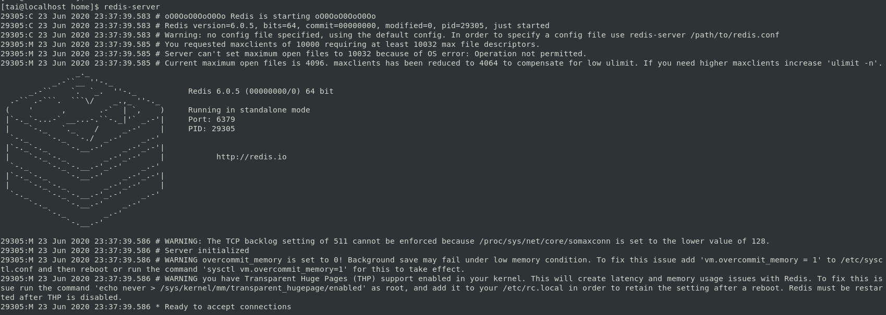
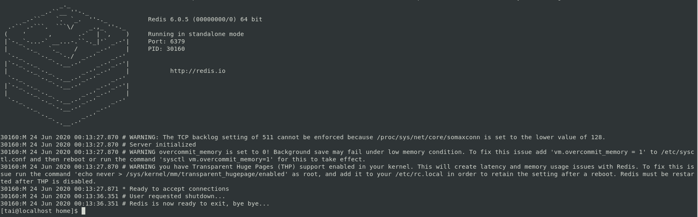

# Redis-6.0.5安裝-以CentOS 7為例
<p align="right">2020.06.23 蔡元泰製</p> 

## 安裝 [[1]](#[1])[[2]](#[2])
### 使用以下指令下載，提取和編譯Redis：
``` shell
$ wget http://download.redis.io/releases/redis-6.0.5.tar.gz
$ tar xzf redis-6.0.5.tar.gz
$ cd redis-6.0.5
$ make distclean && make
```
> ### 可能錯誤:  
> - cc: Command not found -> 乾淨版本的Linux並沒有自帶C語言編譯器，需安裝GCC編譯器。 (版本更新如後). [[3]](#[3]) [[4]](#[4])
>   
> 執行:
>   1. $ cd redis-6.0.5
>   2. $ (sudo) yum install gcc 
>   3. 驗證gcc是否安裝成功: $ rpm -qa |grep gcc   
>   
>   4. $ make   
>   
> -  jemalloc/jemalloc.h: No such file or directory -> 上次編譯有殘留文件，需清理後再重新編譯. [[5]](#[5])  
>   
>   
> - server.c:5172:31: error: ‘struct redisServer’ has no member named 'XXXXX' -> gcc版本不夠新 (CentOS 7 默認安裝4.8.5)，升級至gcc 9. [[6]](#[6])  
>   
> 執行:
>   1. $ cd redis-6.0.5
>   2. $ make distclean # 清除編譯生成的文件.   
>   3. $ (sudo) yum -y install centos-release-scl
>   4. $ (sudo) yum -y install devtoolset-9-gcc devtoolset-9-gcc-c++ devtoolset-9-binutils
>   5. $ scl enable devtoolset-9 bash # scl指令啟用只是臨時的，退出shell或重新打開一個shell就會恢復原系統gcc版本.
>   6. $ sudo sh -c "echo source /opt/rh/devtoolset-9/enable >> /etc/profile" # 執行以永久使用. [[7]](#[7])
>   7. 重打shell (或重開機)，再次編譯. 
>   8. $ gcc -v  # 驗證gcc版本.   
>   

安裝成功:   
>   

## 測試: 
### 使用以下指令執行Redis運行測試：
```shell
$ cd redis-6.0.5
$ make test
```
> ### 可能錯誤:  
> - You need tcl 8.5 or newer in order to run the Redis test -> 未安裝tcl 8.5. [[8]](#[8])  
>   
>   執行:
>   1. $ cd redis-6.0.5
>   2. $ (sudo) yum install tcl   
>   3. 驗證tcl版本: $ echo "puts [info tclversion]" | tclsh   
>   
>    
> - *** [err]: Test FLUSHALL aborts bgsave in tests/integration/rdb.tcl -> 效能配置不足，增加效能配置即可 (測試無法通過，不代表Redis無法運行).[[9]](#[9])
>   
> 執行: 增加 (虛擬機) 記憶體及處理器效能，以下供參:  
>   + 記憶體: 4G.
>   + 處理器: 實體2核心，虛擬2核心，共4核心.
>   + 硬碟: 40G.

運行測試通過:   
  

## 啟動
### 使用以下指令運行Redis：
``` shell
$ cd redis-6.0.5
$ src/redis-server
```
運行成功:
  
## 使用內建客戶端與Redis溝通
### 保持Redis運行，另外開啟shell，並使用下列指令與Redis溝通:
``` shell
$ cd redis-6.0.5
$ src/redis-cli
```
 
- 新增資料: $ set foo bar
 
- 搜尋資料: $ get foo
 

## 快速執行  
### 使用以下指令將主程式複製到/usr/local/bin/: [[4]](#[4])  
``` shell
$ cd redis-6.0.5/
$ sudo cp src/redis-server /usr/local/bin/
$ sudo cp src/redis-cli /usr/local/bin/
```
可以直接無視現在的目錄，直接執行redis的server與client
執行:
- server端:
    ```shell
    $ redis-server
    ```
     
- 客戶端:
  ``` shell
  $ redis-cli
  ```
      

## 參數調整(僅參考) [[4]](#[4])[[10]](#[10])[[11]](#[11])
### 使用以下指令進行參數調整:
- overcommit_memory:
    ``` shell
    echo "vm.overcommit_memory = 1" | sudo tee -a /etc/sysctl.conf
    ```
      
    備註:瞭解overcommit_memory參數設定: [[10]](#[10])[[11]](#[11])
- 監聽佇列的長度(預設:128): [[12]](#[12])
    ``` shell
    echo "net.core.somaxconn = 2048" | sudo tee -a /etc/sysctl.conf
    ```
     


## 關閉Server [[13]](#[13])  
### 可能不是好方法，但能關掉Server，客戶端指令如下:
```shell
$ redis-cli SHUTDOWN NOSAVE
```
查看原先開啟的Server端視窗
      

## 參考來源:
1. https://redis.io/download <a name='[1]'></a>
2. https://linuxize.com/post/how-to-install-and-configure-redis-on-centos-7/ <a name='[2]]'></a>
3. https://www.itread01.com/content/1547765307.html <a name='[3]'></a>
4. https://dotblogs.com.tw/jakeuj/2015/12/24/Redis <a name='[4]'></a>  
5. https://www.cnblogs.com/operationhome/p/10342258.html <a name='[5]'></a>  
6. https://www.cnblogs.com/sanduzxcvbnm/p/12955145.html <a name='[6]'></a> 
7. https://stackoverflow.com/questions/51030702/how-to-write-in-etc-profile-using-bash-permission-denied <a name='[7]'></a> 
8. https://www.cnblogs.com/zhaoshunjie/p/5907029.html <a name='[8]'></a> 
9. https://github.com/antirez/redis/issues/2126 <a name='[9]'></a> 
10. https://access.redhat.com/documentation/zh-tw/red_hat_enterprise_linux/6/html/performance_tuning_guide/s-memory-captun <a name='[10]'></a> 
11. https://blog.csdn.net/hjx_1000/article/details/46412557 <a name='[11]'></a> 
12. https://codertw.com/%E7%A8%8B%E5%BC%8F%E8%AA%9E%E8%A8%80/424386 <a name='[12]'></a> 
13. https://redis.io/commands/shutdown <a name='[13]'></a> 