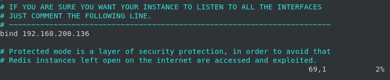
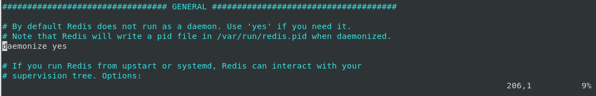
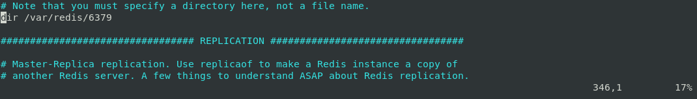
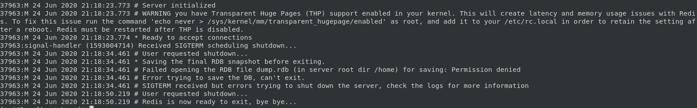

# 安裝Redis-6.0.5-以CentOS 7為例
<p style="text-align:right;">2020.06.23 蔡元泰製</p> 

## 目錄
- [安裝](#安裝)        
- [測試(可忽略)](#測試(可忽略))        
- [啟動](#啟動)          
- [使用內建客戶端與Redis溝通](#使用內建客戶端與redis溝通)          
- [快速執行](#快速執行)
- [建議安裝補充](#建議安裝補充)
- [設定檔參數簡介](#設定檔參數簡介)         
- [關閉Server](#關閉server)  
- [開啟外部訪問](#開啟外部訪問)      
- [管理工具(Windows 10為例)](#管理工具windows-10為例)    
- [參考來源](#參考來源)

---

## 安裝 
### 使用以下指令下載，提取和編譯Redis： [[1]](#[1]) [[2]](#[2])
``` shell
$ cd /opt
$ wget http://download.redis.io/releases/redis-6.0.5.tar.gz
$ tar xzf redis-6.0.5.tar.gz
$ cd redis-6.0.5
$ make distclean && make
```
> ### 可能錯誤:  
> - cc: Command not found -> 未有GCC編譯器(C語言)，安裝即可(版本更新如後). [[3]](#[3]) [[4]](#[4])
>   
> 執行:  
>   ```shell
>   $ cd redis-6.0.5
>   $ sudo yum install gcc 
>   $ rpm -qa |grep gcc # 驗證gcc是否安裝成功
>   ```    
>     
>   ```shell  
>   $ make  
>   ```
> -  jemalloc/jemalloc.h: No such file or directory -> 上次編譯有殘留文件，需清理後再重新編譯，並指定Redis分配器為libc
>   
> 執行:  
>       ```shell
>       cd /opt/redis/redis-6.0.5
>       sudo make distclean && make MALLOC=libc
>       ``` 
> - server.c:5172:31: error: ‘struct redisServer’ has no member named 'XXXXX' -> gcc版本不夠新(CentOS 7 默認安裝4.8.5)，升級至gcc 9. [[6]](#[6])  
>   
> 執行:  
>   ```shell
>   $ cd redis-6.0.5
>   $ make distclean # 清除編譯生成的文件.   
>   $ sudo yum -y install centos-release-scl
>   $ sudo yum -y install devtoolset-9-gcc devtoolset-9-gcc-c++ devtoolset-9-binutils
>   $ scl enable devtoolset-9 bash # scl指令啟用只是臨時的，退出shell或重新打開一個shell就會恢復原系統gcc版本.
>   ```
>   執行以永久使用. [[7]](#[7]) 
>   ```shell
>   $ sudo sh -c "echo source /opt/rh/devtoolset-9/enable >> /etc/profile"  
>   ```
>   重打shell (或重開機)，再次編譯.
>   ```shell
>   $ gcc -v  # 驗證gcc版本.    
>   ```  
>     

安裝成功:   
>   

<div style="text-align:center;">
<a href="#目錄">回到目錄</a>
</div>

---

## 測試(可忽略) 
### 使用以下指令執行Redis運行測試：
```shell
$ cd redis-6.0.5
$ make test
```
> ### 可能錯誤:  
> - You need tcl 8.5 or newer in order to run the Redis test -> 未安裝tcl 8.5. [[8]](#[8])  
>   
>   執行:  
>   ```shell
>   $ cd redis-6.0.5
>   $ sudo yum install tcl   
>   $ echo "puts [info tclversion]" | tclsh # 驗證tcl版本
>   ```
>   
>    
> - *** [err]: Test FLUSHALL aborts bgsave in tests/integration/rdb.tcl -> 效能配置不足，增加效能配置即可 (測試無法通過，不代表Redis無法運行).[[9]](#[9])
>   
> 執行: 增加(虛擬機)記憶體及處理器效能，以下供參:  
>   - 記憶體: 4G.
>   - 處理器: 實體2核心，虛擬2核心，共4核心.
>   - 硬碟: 40G.

運行測試通過:   
  

<div style="text-align:center;">
<a href="#目錄">回到目錄</a>
</div>

---

## 啟動
### 使用以下指令運行Redis：
``` shell
$ cd redis-6.0.5
$ src/redis-server
```
> ### 可能錯誤 (但可能不影響運行):
>  
> - WARNING: The TCP backlog setting of 511 cannot be... (監聽佇列的長度預設128):   
>       執行: [[10]](#[10])  
>   ```shell
>   $ echo "net.core.somaxconn = 2048" | sudo tee -a /etc/sysctl.conf 
>   ``` 
>   
> 
> - WARNING overcommit_memory is set to 0! (内存分配策略參數設置為0):  
>   執行:  
>   ```shell
>   $ echo "vm.overcommit_memory = 1" | sudo tee -a /etc/sysctl.conf
>   ```
>      
>  備註: 其他參數設定詳見: [[11]](#[11])[[12]](#[12]) 
> 
> - WARNING you have Transparent Huge Pages (THP) support enabled in your kernel (你使用的是透明大頁，可能導致redis延遲和內存使用問題)....  
> 執行: [[13]](#[13])  
>   - 暫時解決方法  
>       ```shell
>       $ sudo su # 切換至root帳號，用sudo無法  
>       # echo never > /sys/kernel/mm/transparent_hugepage/enabled
>       # exit # 切換回User帳號
>       ```
>  
>   - 永久解決方法  
>       ```shell
>       $ sudo su
>       # vim /etc/rc.local
>       # echo never > /sys/kernel/mm/transparent_hugepage/enabled  
>       # exit  
>       ```  
運行成功:

 
<div style="text-align:center;">
<a href="#目錄">回到目錄</a>
</div>

---

## 使用內建客戶端與Redis溝通
### 保持Redis運行，另外開啟shell，並使用下列指令與Redis溝通:
``` shell
$ cd redis-6.0.5
$ src/redis-cli
```  
 

- 新增資料: > set foo bar  
 
- 搜尋資料: > get foo  
 

<div style="text-align:center;">
<a href="#目錄">回到目錄</a>
</div>

---

## 快速執行  
### 使用以下指令將主程式複製到/usr/local/bin/: [[4]](#[4])  
``` shell
$ cd redis-6.0.5/
$ sudo cp src/redis-server /usr/local/bin/
$ sudo cp src/redis-cli /usr/local/bin/
```
可以直接無視現在的目錄，直接執行redis的server與client
執行:
- server端:
    ```shell
    $ redis-server
    ```
     
- 客戶端:
  ``` shell
  $ redis-cli
  ```
        

<div style="text-align:center;">
<a href="#目錄">回到目錄</a>
</div>

---

## 建議安裝補充
### 使用以下指令更適當地安裝Redis，以保存數據：[[14]](#[14])
1. 假設已經將redis-server和redis-cli可執行文件複製到/usr/local/bin下，可透過以下指令檢查.
    ```shell
    $ cd /
    $ cd /usr/local/bin
    $ ls
    ```
      
2. 創建一個目錄，用於存儲您Redis配置文件和數據：
    ``` shell
    $ cd /
    $ sudo mkdir /etc/redis
    $ sudo mkdir /var/redis
    ```
3. 找到當初下載Redis檔案處之初始化腳本(以「安裝」之redis-6.0.5為範例)，複製至/etc/init.d/下，官方建議以port為命名.
    ```shell
    $ sudo cp utils/redis_init_script /etc/init.d/redis_6379
    ```  
     
4. 編輯其腳本
   ```shell
   $ sudo vim /etc/init.d/redis_6379
    ```
    - 依據port修改REDISPORT, 其PIDFILE和CONF路徑皆取決於port (例如6379).
      
5. 找到當初下載Redis檔案處(同步驟1)之配置文件模板, 複製到/etc/redis /中
    - 名稱與port相同(例如6379)
        ```shell
        $ sudo cp redis.conf /etc/redis/6379.conf
         ```
         
6. 創建一個目錄，供Redis之數據和工作目錄使用  
    ```shell   
    $ sudo mkdir /var/redis/6379
    ```
7. 編輯配置文件，確保執行以下更改(直接google翻譯) (路人翻譯版, 請詳見: https://kknews.cc/zh-tw/code/y326ymk.html): [[14]](#[14])[[15]](#[15])
    ``` shell
    $ sudo vim /etc/redis/6379.conf 
    ```  
    - line: 69 (選用,供外部訪問)<a name='(供外部訪問)'></a>  
    將ip (預設127.0.0.1)修改為本(虛擬)機ip.  
    綁定多個ip, 可使用bind 127.0.0.1 192.168.xxx.xxx  
         
    - line: 92 (更改port)  
    在本件範例中，使用默認的port (6379)，因此不需要修改.
         
    - line: 206  
    將守護程序(daemonize)設置為'yes' (默認情況下設置為'no'). 
          
    - line: 228  
    將pidfile設置為/var/run/redis_6379.pid (如果需要，請修改port).
          
    - line: 236  
    設置日誌級別.
          
    - line: 241 (日誌檔案的地址)  
    將日誌文件設置為/var/log/redis_6379.log, 該路徑一定要是文件夾.  
          
    - line: 346 (數據持久存放處)  
        將目錄設置為/var/redis/6379 (非常重要的步驟！).  
         

    備註: 若不好找可用/搜尋關鍵字.
8. 將新的Redis腳本設為預設執行
    ```shell
    $ sudo update-rc.d redis_6379 defaults
    ```
    > ### 可能錯誤:
    >   
    > - sudo update-rc.d redis_6379 defaults 可能為Ubuntu 指令, CentOS不受用.  
    > 執行:  [[16]](#16])  
    > $ sudo chkconfig --add redis_6379   
    > $ sudo chkconfig redis_6379 on

9. 執行修改後的Redis
    ```shell
    $ sudo /etc/init.d/redis_6379 start
    ```
10. 檢視redis是否已經啟動  
    ```shell
    $ ps -ef | grep redis  
    ```
- 啟動成功
  

11.  透過客戶端檢視Redis是否執行成功  
        ```shell
        $ redis-cli -h 192.168.xxx.xxx -p 6379
        ```
- 啟動成功
  

 <div style="text-align:center;">
<a href="#目錄">回到目錄</a>
</div>

---
## 設定檔參數簡介
### 使用以下指令及說明瞭解配置參數：
``` shell
$ sudo vim /etc/redis/6379.conf 
```  
- line 18:  
    units are case insensitive so 1GB 1Gb 1gB are all the same.  
    大小寫不敏感，例如：1GB 1Gb 1gB 都是一樣的.  

- line 35:   
    include /path/to/local.conf  
    include /path/to/other.conf  
    共同配置檔位置(叢集式Redis方會使用到，單機版Redis則用不到).  

- line 69:   
    bind 127.0.0.1  
    唯有與上述ip相符之機器方可訪問本Redis，設置多ip訪問須用空格隔開，例如：bind 192.168.1.100 10.0.0.1

- line 88:   
    protected-mode yes  
    保護模式. 設定yes的情況下，在未bind任何允許訪問ip及未設定密碼時，僅允許本機訪問.  

- line 92:  
    port 6379  
    啟動服務會佔用之port號.  

- line 101:  
    tcp-backlog 511  
    最大隊列長度(可理解為最大請求排隊數)，應付突發的大並發連接請求. 但linux預設為128. 所以再啟動Redis時會出現警告，但可忽略.

- line 130:  
    tcp-keepalive 300  
    客戶端空閒N秒(未發任何請求)後關閉連接.  

- line 206:  
    daemonize no  
    是否為背景執行，no -> 不背景執行，表會有畫面可以看到監控畫面. yes -> 背景執行.  

- line 228:  
    pidfile /var/run/redis_6379.pid  
    進程id (pid)存放位置(每次重新啟動產生不同的pid文件). 若直接輸入數字可供事後方便停止服務(kill -9)之用. 

- line 236:  
    loglevel notice  
    日誌記錄級別.  

- line 241:  
    logfile ""  
    指定日誌文件名(或日誌存放位置).  

- line 256:  
    databases 16  
    資料庫數量.    

- line 809:  
    maxclients 10000  
    最大客戶端數量.  

- line 836:  
    maxmemory <bytes>  
    最大內存.

- line 867:  
    maxmemory-policy noeviction  
    超過最大內存後所執行之策略.  

- line 878:  
    maxmemory-samples 5  
    根據line 867「超過最大內存後所執行之策略」後，所刪除資料數.  

 <div style="text-align:center;">
<a href="#目錄">回到目錄</a>
</div>

---

## 關閉Server
### 在客戶端使用以下指令關閉Server:
- 官方建議方法，確保在退出之前將數據保存:
    ```shell
    $ redis-cli SHUTDOWN
    ```
    查看原先開啟的Server端視窗 
      

- 應該與上者類似，但未將數據保存(無法退出時，可用此指令): [[17]](#[17])
    ```shell
    $ redis-cli SHUTDOWN NOSAVE
    ```
  查看原先開啟的Server端視窗  
     

- 正常退出，但有時候不成功: [[18]](#[18])
    ```shell
    $ pkill redis-server
    ```
     查看原先開啟的Server端視窗  
      

- 強制關閉(沒有log釋出): [[19]](#[19])
    ```shell
    $ ps -a # 查看現有redis-server之PID
    $ kill -9 3365 # 3365為該server之PID
    ```
      
    查看原先開啟的Server端視窗  
    
    
<div style="text-align:center;">
<a href="#目錄">回到目錄</a>
</div>

---

## 開啟外部訪問
###  使用以下指令使其Redis允許外部訪問:
1. 編輯配置文件，確保執行以下更改(步驟同「建議安裝補充」[(供外部訪問)](#(供外部訪問))： [[15]](#[15])
    ``` shell
    $ sudo vim /etc/redis/6379.conf 
    ```
    將ip (預設127.0.0.1)修改為本(虛擬)機ip.
     
    > ### 可能錯誤:
    > - 外部無法連線 (以win 10為例)
    >    ``` cmd 
    >   > telnet 192.168.xxx.xxx 6379 
    >    ```
    >     
    >   透過MobaXterm之掃port工具(上方工具列Tools > Ports scanner), Cent OS未外開Redis的port.
    >   
    > 執行:  
    >   1. 確認防火牆是否開啟 
    >       ``` shell
    >       $ firewall-cmd --zone=public --list-all  
    >       ```
    >       
    >   2. 對外開放 6379 port  
    >       ``` shell  
    >       $ firewall-cmd --zone=public --add-port=6379/tcp --permanent 
    >       ``` 
    >       備註: --permanent 指定為永久設定，否則在 firewalld 重啟或是重新讀取設定，就會失效.
    >      
    >   3. 重新讀取 firewall 設定  
    >       ``` shell 
    >       $ firewall-cmd --reload
    >       ```
    >       
    >   4. 與步驟1同，再檢查一次指定port是否在開放清單內  
    >       ``` shell
    >       $ firewall-cmd --zone=public --list-all 
    >       ``` 
    >       
    >   5. 重新從本地端cmd測試  
    >       ``` cmd
    >       > telnet 192.168.xxx.xxx 6379 
    >       ``` 
    >       成功, 就是黑黑的一片.  
    >       

<div style="text-align:center;">
<a href="#目錄">回到目錄</a>
</div>

---

## 管理工具(Windows 10為例)
### 使用以下指令於cmd下操作:
- Redis-commander
  1. 檢查有無npm環境:
      ```shell
      > npm -v
      ```
     - 有
           
     - 無  
       請自行安裝.
  2. 安裝redis-commander [[19]](#[19])  
     ```shell
     > npm install -g redis-commander
     ```
      
  3. 啟動redis-commander
       - 連結本地端Server
            ```shell
            > redis-commander
            ```
              
        - 連結至外部Redis
            ```shell
            redis-commander --redis-host 192.168.xxx.xxx --redis-port 6379
            ```
  4. 將上述畫面ip (http://127.0.0.1:8081)以瀏覽器開啟  
      


備註:其他管理工具GUI: [[20]](#[20]) 

<div style="text-align:center;">
<a href="#目錄">回到目錄</a>
</div>

---

## 參考來源
1. https://redis.io/download <a name='[1]'></a>
2. https://linuxize.com/post/how-to-install-and-configure-redis-on-centos-7/ <a name='[2]'></a>
3. https://www.itread01.com/content/1547765307.html <a name='[3]'></a>
4. https://dotblogs.com.tw/jakeuj/2015/12/24/Redis <a name='[4]'></a>  
5. https://www.cnblogs.com/operationhome/p/10342258.html <a name='[5]'></a>  
6. https://www.cnblogs.com/sanduzxcvbnm/p/12955145.html <a name='[6]'></a> 
7. https://stackoverflow.com/questions/51030702/how-to-write-in-etc-profile-using-bash-permission-denied <a name='[7]'></a> 
8. https://www.cnblogs.com/zhaoshunjie/p/5907029.html <a name='[8]'></a> 
9. https://github.com/antirez/redis/issues/2126 <a name='[9]'></a> 
10. https://codertw.com/%E7%A8%8B%E5%BC%8F%E8%AA%9E%E8%A8%80/424386 <a name='[10]'></a> 
11. https://access.redhat.com/documentation/zh-tw/red_hat_enterprise_linux/6/html/performance_tuning_guide/s-memory-captun <a name='[11]'></a> 
12. https://blog.csdn.net/hjx_1000/article/details/46412557 <a name='[12]'></a> 
13. https://www.jianshu.com/p/7ca4b74c92be  <a name='[13]'></a>  
14. https://redis.io/topics/quickstart <a name='[14]'></a> 
15. https://www.itread01.com/content/1546782362.html <a name='[15]'></a> 
16. https://unix.stackexchange.com/questions/65398/converting-update-rc-d-redis-6379-defaults-to-chkconfig-command <a name='[16]'></a> 
17. https://redis.io/commands/shutdown <a name='[17]'></a> 
18. http://www.jeepxie.net/article/964280.html <a name='[18]'></a> 
19. https://www.npmjs.com/package/redis-commander <a name='[19]'></a>
20. https://redislabs.com/blog/so-youre-looking-for-the-redis-gui/ <a name='[20]'></a>

<div style="text-align:center;">
<a href="#目錄">回到目錄</a>
</div>