# 安裝Redis-6.0.5-集群-以CentOS 7為例
<p style="text-align:right;">2020.06.23 蔡元泰製</p> 

## 目錄
- [安裝](#安裝)
- [試啟動](#試啟動)
- [使用內建客戶端與Redis溝通](#使用內建客戶端與redis溝通)
- [快速執行](#快速執行)
- [建議安裝補充](#建議安裝補充)
- [簡單測試](#簡單測試)
- [開啟外部連線功能](#開啟外部連線功能)
- [參考來源:](#參考來源)

---

## 安裝
### 使用以下指令下載，提取和編譯Redis：
``` shell
$ mkdir /opt/redis
$ cd /opt/redis
$ wget http://download.redis.io/releases/redis-6.0.5.tar.gz
$ tar xzf redis-6.0.5.tar.gz
$ cd redis-6.0.5
$ sudo make distclean && sudo make
```

> ### 可能錯誤:  
> - cc: Command not found -> 未有GCC編譯器(C語言)，安裝即可(版本更新如後).
>   
> 執行:  
>   ```shell
>   $ cd /opt/redis/redis-6.0.5
>   $ sudo yum install gcc 
>   $ rpm -qa | grep gcc # 驗證gcc是否安裝成功  
>   ```    
>     
>   ```shell  
>   $ sudo make  
>   ```
> -  jemalloc/jemalloc.h: No such file or directory -> 上次編譯有殘留文件，需清理後再重新編譯，並指定Redis分配器為libc  
>   
> 執行:  
>       ```shell
>       cd /opt/redis/redis-6.0.5
>       sudo make distclean && sudo make MALLOC=libc
>       ```
> - server.c:5172:31: error: ‘struct redisServer’ has no member named 'XXXXX' -> gcc版本不夠新(CentOS 7 默認安裝4.8.5)，升級至gcc 9.   
> 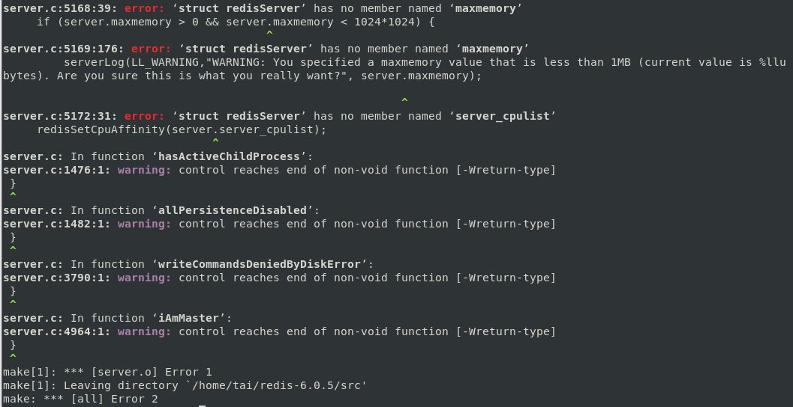  
> 執行:  
>   ```shell  
>   $ cd /opt/redis/redis-6.0.5  
>   $ make distclean # 清除編譯生成的文件.   
>   $ sudo yum -y install centos-release-scl  
>   $ sudo yum -y install devtoolset-9-gcc devtoolset-9-gcc-c++
>   $ sudo yum -y install devtoolset-9-binutils 
>   $ scl enable devtoolset-9 bash # scl指令啟用只是臨時的，退出shell或重新打開一個shell就會恢復原系統gcc版本.  
>   ```  
>   執行以永久使用.  
>   ```shell  
>   $ sudo sh -c "echo source /opt/rh/devtoolset-9/enable >> /etc/profile"  
>   ```  
>   重打shell (或重開機)，再次編譯.  
>   ```shell  
>   $ gcc -v  # 驗證gcc版本.    
>   ```  
>   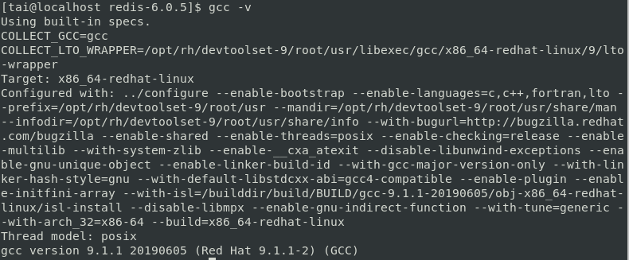  

安裝成功:   
>   

[回到目錄](#目錄)

---

## 試啟動
### 使用以下指令運行Redis：
``` shell
$ cd /opt/redis/redis-6.0.5
$ src/redis-server
```
> ### 可能錯誤 (但可能不影響運行):
> 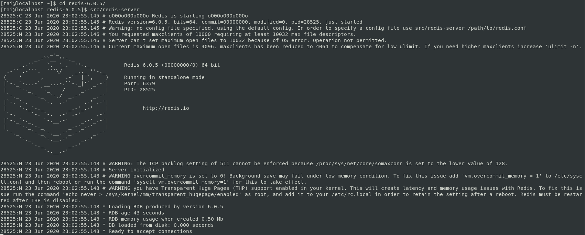 
> - WARNING: The TCP backlog setting of 511 cannot be... (監聽佇列的長度預設128):   
>       執行:   
>   ```shell
>   $ echo "net.core.somaxconn = 2048" | sudo tee -a /etc/sysctl.conf 
>   ``` 
>   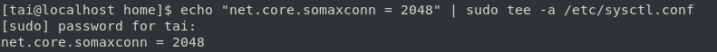
> 
> - WARNING overcommit_memory is set to 0! (内存分配策略參數設置為0):  
>   執行:  
>   ```shell
>   $ echo "vm.overcommit_memory = 1" | sudo tee -a /etc/sysctl.conf
>   ```
>    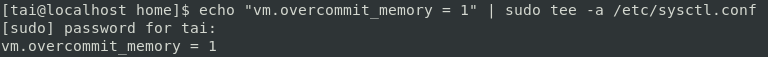    
> 
> - WARNING you have Transparent Huge Pages (THP) support enabled in your kernel (你使用的是透明大頁，可能導致redis延遲和內存使用問題)....  
> 執行: [[13]](#[13])  
>   - 暫時解決方法  
>       ```shell
>       $ sudo su # 切換至root帳號，用sudo無法  
>       # echo never > /sys/kernel/mm/transparent_hugepage/enabled
>       # exit # 切換回User帳號
>       ```
>  
>   - 永久解決方法  
>       ```shell
>       $ sudo su
>       # vim /etc/rc.local
>       # echo never > /sys/kernel/mm/transparent_hugepage/enabled  
>       # exit  
>       ```  
運行成功:
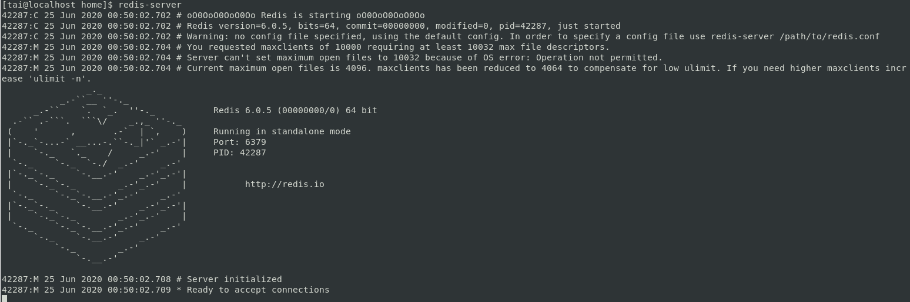
 
[回到目錄](#目錄)

---

## 使用內建客戶端與Redis溝通
### 保持Redis運行，另外開啟shell，並使用下列指令與Redis溝通:
``` shell
$ cd redis-6.0.5
$ src/redis-cli
```  
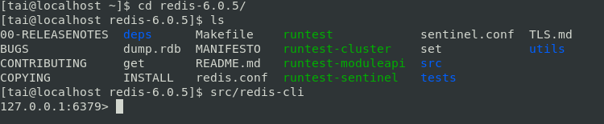 

- 新增資料: > set foo bar  
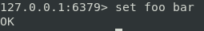 
- 搜尋資料: > get foo  
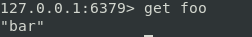 

[回到目錄](#目錄)


---

## 快速執行  
``` shell
$ cd /opt/redis/redis-6.0.5/
```
可以直接無視現在的目錄，直接執行redis的server與client
執行:
- server端:
    ```shell
    $ redis-server
    ```
     
- 客戶端:
  ``` shell
  $ redis-cli
  ```
     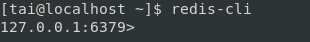   

[回到目錄](#目錄)

---

## 建議安裝補充
### 使用以下指令更適當地安裝Redis，以保存數據. 本文沿用「安裝Redis-6.0.5-CentOS7」，相關port請自行代換：
1. 假設已經將redis-server和redis-cli可執行文件複製到/usr/local/bin下，可透過以下指令檢查.
    ```shell
    $ cd /
    $ cd /usr/local/bin
    $ ls
    ```
      
2. 創建一個目錄，用於存儲您Redis配置文件和數據：
    ``` shell
    $ cd /
    $ sudo mkdir /etc/redis
    $ sudo mkdir /var/redis
    ```
3. 找到當初下載Redis檔案處之初始化腳本(以「安裝」之redis-6.0.5為範例)，複製至/etc/init.d/下，官方建議以port為命名.
    ```shell
    $ sudo cp utils/redis_init_script /etc/init.d/redis_6379
    ```  
    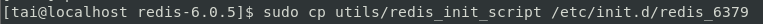 
4. 編輯其腳本
   ```shell
   $ sudo vim /etc/init.d/redis_6379
    ```
    - 依據port修改REDISPORT, 其PIDFILE和CONF路徑皆取決於port (例如6379).  
    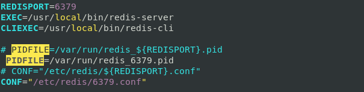  
5. 找到當初下載Redis檔案處(同步驟1)之配置文件模板, 複製到/etc/redis /中
    - 名稱與port相同(例如6379)
        ```shell
        $ sudo cp redis.conf /etc/redis/6379.conf
         ```
        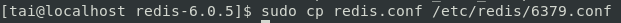 
6. 創建一個目錄，供Redis之數據和工作目錄使用  
    ```shell   
    $ sudo mkdir /var/redis/6379
    ```
7. 編輯配置文件，確保執行以下更改(直接google翻譯) (路人翻譯版, 請詳見: https://kknews.cc/zh-tw/code/y326ymk.html):
    ``` shell
    $ sudo vim /etc/redis/6379.conf 
    ```  
    - line: 69 (選用,供外部訪問)<a name='(供外部訪問)'></a>  
    將ip (預設127.0.0.1)修改為本(虛擬)機ip.  
    綁定多個ip, 可使用bind 127.0.0.1 192.168.xxx.xxx  
        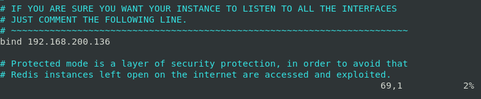 
    - line: 92 (更改port)  
    在本件範例中，使用默認的port (6379)，因此不需要修改.  
        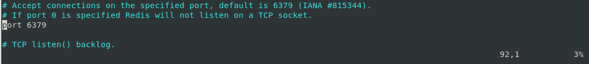 
    - line: 206  
    將守護程序(daemonize)設置為'yes' (默認情況下設置為'no').   
        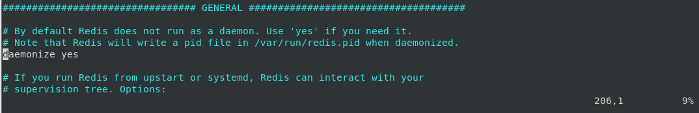  
    - line: 228  
    將pidfile設置為/var/run/redis_6379.pid (如果需要，請修改port).
          
    - line: 236  
    設置日誌級別.  
        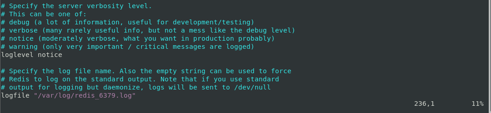  
    - line: 241 (日誌檔案的地址)  
    將日誌文件設置為/var/log/redis_6379.log, 該路徑一定要是文件夾.  
          
    - line: 346 (數據持久存放處)  
        將目錄設置為/var/redis/6379 (非常重要的步驟！).  
        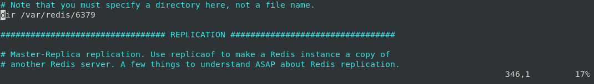 

    備註: 若不好找可用/搜尋關鍵字.
8. 將新的Redis腳本設為預設執行
    ```shell
    $ sudo update-rc.d redis_6379 defaults
    ```
    > ### 可能錯誤:
    >  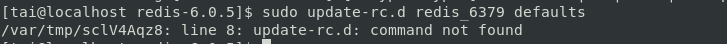 
    > - sudo update-rc.d redis_6379 defaults 可能為Ubuntu 指令, CentOS不受用.  
    > 執行:  [[16]](#16])  
    > $ sudo chkconfig --add redis_6379   
    > $ sudo chkconfig redis_6379 on

9. 執行修改後的Redis
    ```shell
    $ sudo /etc/init.d/redis_6379 start
    ```
10. 檢視redis是否已經啟動  
    ```shell
    $ ps -ef | grep redis  
    ```
- 啟動成功  
 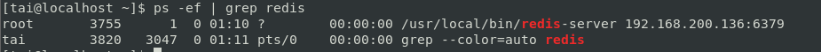 

11.  透過客戶端檢視Redis是否執行成功  
        ```shell
        $ redis-cli -h 192.168.xxx.xxx -p 6379
        ```
- 啟動成功  
 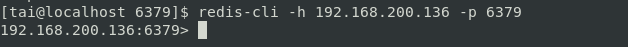 

[回到目錄](#目錄)

---

## 啟動Redis集群模式  
### 依循下列步驟，啟動設置並啟動Redis集群模式  
1. 建立相關目錄
    ```shell  
    $ sudo mkdir /var/run/redis/redis-cluster # 建置配置pid文件需資料夾
    $ sudo chown tai:tai /var/run/redis/* # 修改權限
    $
    $ cd /opt/redis
    $ sudo mkdir redis-cluster
    $ cd redis-cluster
    $ mkdir conf data log
    $ mkdir -p data/redis-7000 data/redis-7001 data/redis-7002 data/redis-8000 data/redis-8001 data/redis-8002
    ```  
    備註: port: 7000為主機(master)，8000則為從機(slave)，以利區分.  

2. 建置Redis相關配置檔  
      1. 建立配置檔(依port命名)  
         ``` shell  
         $ cd /opt/redis/redis-cluster/conf
         $ sudo cp /opt/redis/redis-6.0.5/redis.conf redis.conf
         $ touch redis-7000.conf redis-7001.conf redis-7002.conf
         $ touch redis-8000.conf redis-8001.conf redis-8002.conf
         $ sudo chmod 775 * # 如果有需要，統一修改權限
         ```  
      2. 編輯配置檔(以7000為例)  
         ```shell  
         $ sudo vim redis-7000.conf 
         ```   
         
           - 於配置檔中，輸入相關配置  
            
            ```shell  
            include /opt/redis/redis-cluster/conf/redis.conf
            daemonize yes  
            bind 192.168.200.141 127.0.0.1 
            dir /opt/redis/redis-cluster/data/redis-7000  
            pidfile /var/run/redis/redis-cluster/redis-7000.pid  
            logfile /opt/redis/redis-cluster/log/redis-7000.log
            port 7000  
            cluster-enabled yes  
            cluster-config-file /opt/redis/redis-cluster/conf/node-7000.conf  
            cluster-node-timeout 10000  
            appendonly yes  
            ```  
            備註:有關bind，建議外部ip放前面，避免無法外部連線.  
   
           - 參數說明:  
            ```shell  
            # 其他本配置檔未設定之設定參照來源   
            include /opt/redis/redis-cluster/conf/redis.conf  
            
            # 守護模式(背景執行)  
            daemonize yes  
            # 繫結的主機埠  
            bind 192.168.200.141 127.0.0.1 # 外部ip依需求調整   
            # 資料存放目錄  
            dir /opt/redis/redis-cluster/data/redis-7000  
            # 程序檔案  
            pidfile /var/run/redis-cluster/redis-7000.pid  
            # 日誌檔案  
            logfile /opt/redis/redis-cluster/log/redis-7000.log  
            # 埠號  
            port 7000  
            # 開啟叢集模式  
            cluster-enabled yes  
            # 叢集的配置，配置檔案首次啟動自動生成  
            cluster-config-file /opt/redis/redis-cluster/conf/node-7000.conf  
            # 請求超時，設定10秒  
            cluster-node-timeout 10000
            # aof日誌開啟，有需要就開啟，它會每次寫操作都記錄一條日誌  
            appendonly yes  
            ```
           - 其他配置檔(7001, 7002, 8000, 8001, 8002)，同理.  
  
3. 啟動伺服器  
    執行下列指令，以啟動伺服器.  
    ```shell
    $ cd /opt/redis/redis-cluster
    $ redis-server conf/redis-7000.conf
    $ redis-server conf/redis-7001.conf
    $ redis-server conf/redis-7002.conf
    $ redis-server conf/redis-8000.conf
    $ redis-server conf/redis-8001.conf
    $ redis-server conf/redis-8002.conf
    ```
    > ### 可能錯誤:  
    > - Can't open the append-only file: Permission denied  
    > 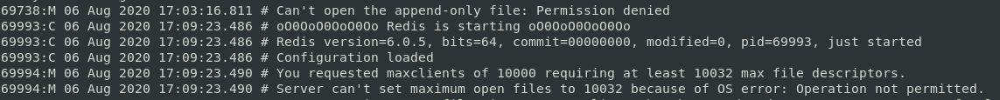  
    >   原因: 權限不足寫入aof日誌.  
    >   執行下列指令開啟相關權限  
    >   ```shell 
    >   $ cd /opt/
    >   $ sudo chmod -R 775 redis # 修改目錄下權限
    >   $ sudo chown -R tai:root redis # 修改目錄(檔案)擁有者
    >   ```  


4. 測試是否啟動  
   執行以下指令，檢視伺服器是否啟動.  
    ```shell  
    $ ps -ef | grep redis
    ```  
    成功啟動
    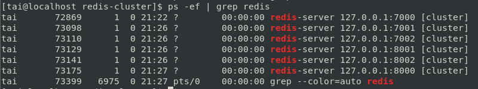  

5. 建立集群關係  
   執行以下指令，建立Redis集群關係. Redis 5以上方可使用，以下則需使用redis-trib.rb建立(本篇不演示).  
   ```shell  
   $ redis-cli --cluster create 192.168.200.141:7000 192.168.200.141:7001  192.168.200.141:7002 192.168.200.141:8000 192.168.200.141:8001 192.168.200.141:8002  --cluster-replicas 1  # cluster-replicas 表示每1個主機要有1個從機.
   ``` 
   備註: 按照從主機到從機的方式， 從左到右，依次排列6個 Redis節點。
    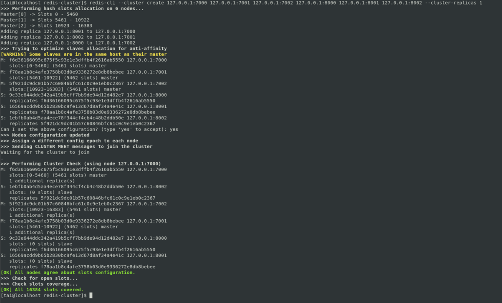  

6. 檢視集群關係  
    執行以下指令，檢視各port伺服器之間的關係.  
    1. 以客戶端進入port 7000的Redis
        ```shell  
        $ redis-cluster]$ redis-cli -c -p 7000 # -c: cluster, -p: port  
        $ 127.0.0.1:7000> info replication
        ``` 
        port 7000為主機，連接1個從.  
        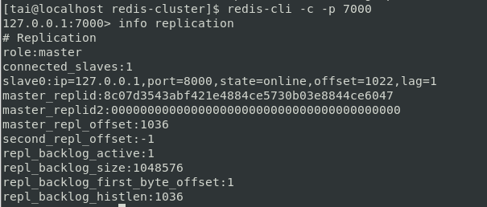  
    2. 退出該客戶端  
        ```shell  
        $ 127.0.0.1:7000> quit
        ``` 

    3. 以客戶端進入port 8000的Redis  
         ```shell  
        $ redis-cluster]$ redis-cli -c -p 8000 
        $ 127.0.0.1:8000> info replication
        ```   
        port 8000為從機. 跟隨之主機為port 7000.  
        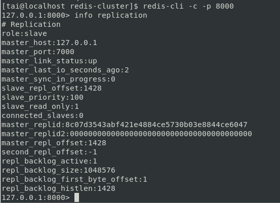 

    4. 退出該客戶端  
        ```shell  
        $ 127.0.0.1:8000> quit  
        ```   

[回到目錄](#目錄)

---

## 簡單測試  
### 依循下列步驟，簡單測試Redis集群功能  
1. 進入port 7000客戶端，輸入1筆資料  
   ```shell 
   $ redis-cli -c -p 7000  
   127.0.0.1:7000> set k1 v1  
   ```
   資料自動分配存入port 7001 Redis.  
    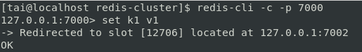

2. 進入port 7001客戶單，讀取1筆資料  
    ```shell 
    127.0.0.1:7000> quit # 退出port 7000客戶端  
    $ redis-cli -c -p 7001  
    127.0.0.1:7001> get k1 # 讀取資料  
    ```
    成功從port 7001 Redis讀取資料.  
    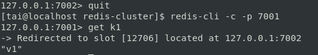

[回到目錄](#目錄)

---  

## 開啟外部連線功能
### 執行下列指令，開啟CentOS 7 防火牆之port  
1. 開啟redis port
    ```shell
    $ sudo firewall-cmd --zone=public --add-port=7001/tcp --permanent
    $ sudo firewall-cmd --zone=public --add-port=7002/tcp --permanent
    $ sudo firewall-cmd --zone=public --add-port=8000/tcp --permanent
    $ sudo firewall-cmd --zone=public --add-port=8001/tcp --permanent
    $ sudo firewall-cmd --zone=public --add-port=8002/tcp --permanent
    ```  
    成功  
    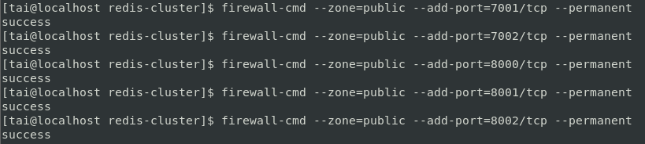  
2. 重啟防火牆 
   ```shell  
   $ sudo firewall-cmd --reload
   ````  
   成功  
    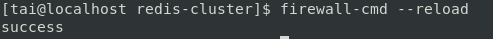  
3. 檢測是否有成功開啟對外port
    ```shell 
    $ sudo firewall-cmd --zone=public --query-port=7000/tcp
    $ sudo firewall-cmd --zone=public --query-port=7001/tcp
    $ sudo firewall-cmd --zone=public --query-port=7002/tcp
    $ sudo firewall-cmd --zone=public --query-port=8000/tcp
    $ sudo firewall-cmd --zone=public --query-port=8001/tcp
    $ sudo firewall-cmd --zone=public --query-port=8002/tcp  
    ```  
    成功  
    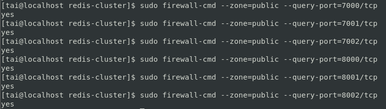  
4. 簡單的使用本地端cmd測試  
    ```shell  
    > telent 192.168.xxx.xxx 7000  
    ````
    成功，就是黑壓壓的一片  
    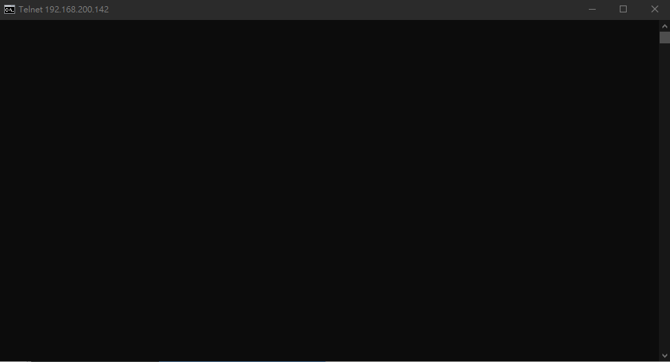 

---  

## 參考來源: 
1. https://redis.io/topics/cluster-tutorial
2. https://www.itread01.com/lqqf.html

[回到目錄](#目錄)

---


