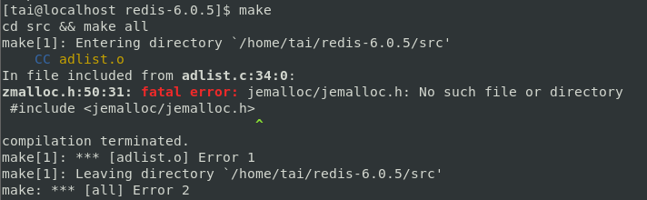
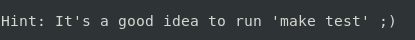
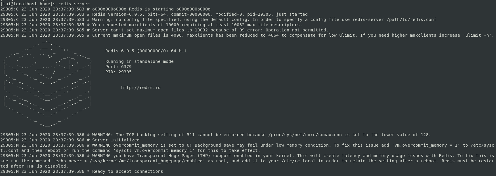

# 安裝Redis-6.0.5-集群-以CentOS 7為例
<p style="text-align:right;">2020.06.23 蔡元泰製</p> 

---
## 安裝
### 使用以下指令下載，提取和編譯Redis：
``` shell
$ mkdir /opt/redis
$ cd /opt/redis
$ wget http://download.redis.io/releases/redis-6.0.5.tar.gz
$ tar xzf redis-6.0.5.tar.gz
$ cd redis-6.0.5
$ make distclean && make
```

> ### 可能錯誤:  
> - cc: Command not found -> 未有GCC編譯器(C語言)，安裝即可(版本更新如後).
>   
> 執行:  
>   ```shell
>   $ cd /opt/redis/redis-6.0.5
>   $ sudo yum install gcc 
>   $ rpm -qa |grep gcc # 驗證gcc是否安裝成功  
>   ```    
>     
>   ```shell  
>   $ make  
>   ```
> -  jemalloc/jemalloc.h: No such file or directory -> 上次編譯有殘留文件，需清理後再重新編譯，並指定Redis分配器為libc
>   
> 執行:  
>       ```shell
>       cd /opt/redis/redis-6.0.5
>       sudo make distclean && make MALLOC=libc
>       ```
> - server.c:5172:31: error: ‘struct redisServer’ has no member named 'XXXXX' -> gcc版本不夠新(CentOS 7 默認安裝4.8.5)，升級至gcc 9.   
>   
> 執行:  
>   ```shell  
>   $ cd /opt/redis/redis-6.0.5  
>   $ make distclean # 清除編譯生成的文件.   
>   $ sudo yum -y install centos-release-scl  
>   $ sudo yum -y install devtoolset-9-gcc devtoolset-9-gcc-c++ devtoolset-9-binutils  
>   $ scl enable devtoolset-9 bash # scl指令啟用只是臨時的，退出shell或重新打開一個shell就會恢復原系統gcc版本.  
>   ```  
>   執行以永久使用.  
>   ```shell  
>   $ sudo sh -c "echo source /opt/rh/devtoolset-9/enable >> /etc/profile"  
>   ```  
>   重打shell (或重開機)，再次編譯.  
>   ```shell  
>   $ gcc -v  # 驗證gcc版本.    
>   ```  
>     

安裝成功:   
>   

<div style="text-align:center;">
<a href="#目錄">回到目錄</a>
</div>

---

## 試啟動
### 使用以下指令運行Redis：
``` shell
$ cd redis-6.0.5
$ src/redis-server
```
> ### 可能錯誤 (但可能不影響運行):
>  
> - WARNING: The TCP backlog setting of 511 cannot be... (監聽佇列的長度預設128):   
>       執行:   
>   ```shell
>   $ echo "net.core.somaxconn = 2048" | sudo tee -a /etc/sysctl.conf 
>   ``` 
>   
> 
> - WARNING overcommit_memory is set to 0! (内存分配策略參數設置為0):  
>   執行:  
>   ```shell
>   $ echo "vm.overcommit_memory = 1" | sudo tee -a /etc/sysctl.conf
>   ```
>        
> 
> - WARNING you have Transparent Huge Pages (THP) support enabled in your kernel (你使用的是透明大頁，可能導致redis延遲和內存使用問題)....  
> 執行: [[13]](#[13])  
>   - 暫時解決方法  
>       ```shell
>       $ sudo su # 切換至root帳號，用sudo無法  
>       # echo never > /sys/kernel/mm/transparent_hugepage/enabled
>       # exit # 切換回User帳號
>       ```
>  
>   - 永久解決方法  
>       ```shell
>       $ sudo su
>       # vim /etc/rc.local
>       # echo never > /sys/kernel/mm/transparent_hugepage/enabled  
>       # exit  
>       ```  
運行成功:

 
<div style="text-align:center;">
<a href="#目錄">回到目錄</a>
</div>

---

## 使用內建客戶端與Redis溝通
### 保持Redis運行，另外開啟shell，並使用下列指令與Redis溝通:
``` shell
$ cd redis-6.0.5
$ src/redis-cli
```  
 

- 新增資料: > set foo bar  
 
- 搜尋資料: > get foo  
 

<div style="text-align:center;">
<a href="#目錄">回到目錄</a>
</div>

---

## 快速執行  
### 使用以下指令將主程式複製到/usr/local/bin/: 
``` shell
$ cd redis-6.0.5/
$ sudo cp src/redis-server /usr/local/bin/
$ sudo cp src/redis-cli /usr/local/bin/
```
可以直接無視現在的目錄，直接執行redis的server與client
執行:
- server端:
    ```shell
    $ redis-server
    ```
     
- 客戶端:
  ``` shell
  $ redis-cli
  ```
        

<div style="text-align:center;">
<a href="#目錄">回到目錄</a>
</div>

---

## 啟動Redis集群模式-讀寫分離
### 使用以下指令運行Redis集群模式-讀寫分離：  
1. 將預設設定檔放置指定目錄下，並修改設定檔:
   ```shell
    $ mkdir /opt/redis/conf
    $ cp /opt/redis/redis-6.0.5/redis.conf /opt/redis/conf/redis.conf # 做為主設定檔
    $ chmod 775 /opt/redis/conf/redis.conf # 修改權限(可略)
    $ vim /opt/redis/conf/redis.conf
    ```  
    - line: 69 (選用,供外部訪問)<a name='(供外部訪問)'></a>  
    將ip (預設127.0.0.1)修改為本(虛擬)機ip.  
    綁定多個ip, 可使用bind 127.0.0.1 192.168.xxx.xxx  
         
    <!-- - line: 92 (更改port)  
    在本件範例中，使用默認的port (6379)，因此不需要修改.
          -->
    - line: 206  
    將守護程序(背景執行)(daemonize)設置為'yes' (默認情況下設置為'no'). 
          
    <!-- - line: 228  
    將pidfile設置為/var/run/redis_6379.pid (如果需要，請修改port).
           -->
    - line: 236  
    設置日誌級別.
          
    <!-- - line: 241 (日誌檔案的地址)  
    將日誌文件設置為/var/log/redis_6379.log, 該路徑一定要是文件夾.  
           -->
    <!-- - line: 346 (數據持久存放處)  
        將目錄設置為/var/redis/6379 (非常重要的步驟！).  
          -->

2. 複製設定檔為master, slave設定檔至ms目錄下:  
    - port: 6379為master，其他則為slave.  
   ```shell
    $ mkdir /opt/redis/conf/ms
    $ cd /opt/redis/conf/ms
    $ for i in {6379..6382} # 利用迴圈複製設定檔，並以port命名
    $ do
    $ sudo touch redis$i.conf
    $ sudo chmod 775 redis$i.conf # 修改權限(可略)
    $ # 將相關設定寫入conf
    $ echo "include /opt/redis/conf/redis.conf" >> redis$i.conf # 其他設定檔依設定檔為主
    $ echo "pidfile /var/run/redis_$i.pid" >> redis$i.conf # pid寫入位置
    $ echo "port $i" >> redis$i.conf # port號
    $ echo "dbfilename dump$i.rdb" >> redis$i.conf # db名稱
    $ if [ $i -ne 6379 ] 
    $ then 
    $ echo "slaveof local 6379" >> redis$i.conf # 以port 6379 為master, 自己為slave
    $ echo "slave port : $i"
    $ else
    $ echo "master port : $i"
    $ fi 
    $ done
    ```  
    或直接複製:  
    for i in {6379..6382};   
        do  
            sudo touch redis$i.conf;   
            sudo chmod 775 redis$i.conf;  
            echo "include /opt/redis/conf/redis.conf" >> redis$i.conf ;   
            echo "pidfile /var/run/redis_$i.pid" >> redis$i.conf ;   
            echo "port $i" >> redis$i.conf ;   
            echo "dbfilename dump$i.rdb" >> redis$i.conf ;    
            if [ $i -ne 6379 ] ;  
                then echo "slaveof local 6379" >> redis$i.conf;   
                echo "slave port : $i";   
            else   
                echo "master port : $i  ";   
            fi ;  
        done  

3. 啟動伺服器
    使用以下指令啟動伺服器:
    ```shell 
    $ for i in {6379..6382};   
    $ do  
    $ redis-server /opt/redis/conf/ms/redis$i.conf
    $ done 
    ```  
    或直接複製:  
    for i in {6379..6382};   
        do  
            redis-server /opt/redis/conf/ms/redis$i.conf  
        done 
4. 驗證是否啟動  
    ```shell
    $ ps -ef | grep redis  
    ```
    啟動成功  
      
